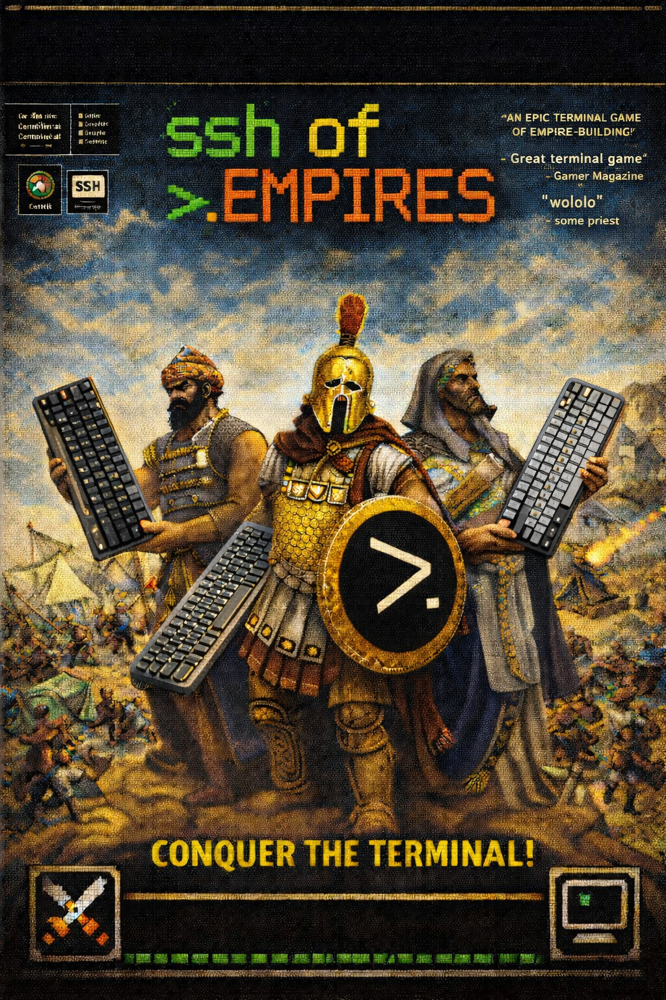

# SSH of Empires

<p align="center">
  
</p>

Welcome to **SSH of Empires**, a terminal RTS inspired by the original Age of Empires. You gather resources, build your settlement, train armies, advance through the ages, and crush rival civilizations, all through a keyboard-only interface over a plain SSH session.

**Play it now at**
> `ssh -p 2222 -t player@ssh-of-empires.juanmartinez.xyz`

The public deployment allows anonymous SSH access for the `player` account and drops the session straight into the game.

## What Kind of Game Is This?

SSH of Empires is an homage to Age of Empires that can be played entirely in a text terminal.

You begin with:

- `1` Town Center
- `3` Villagers
- `1` Scout

From there, you must:

- gather `food`, `wood`, `gold`, and `stone`
- expand your economy
- increase your population cap with houses
- build military production
- research upgrades
- advance through the ages
- destroy your opponents before they destroy you

There are two main ways to play:

- `Single Player`: you play against an AI civilization
- `Multiplayer`: `2` to `3` human players join the same room and fight in the same shared match

## Starting the Game

Run locally:

```bash
python3 aoe_terminal.py
```

Recommended terminal size:

- width: at least `90`
- height: at least `22`

When the game starts, choose:

- `Single Player`
- `Multiplayer`
- `Quit`

## Reading the Battlefield

The map uses Japanese characters for units, buildings, and resources.

### Resource Symbols

- `木` Tree: source of wood
- `果` Berry Bush: source of food
- `鹿` Gazelle: living huntable animal
- `肉` Carcass: food left behind after a villager kill
- `金` Gold Vein: source of gold
- `石` Stone Outcrop: source of stone
- `.` or `,`: explored terrain / fogged terrain

### Unit Symbols

- `民` Villager: gathers resources and constructs buildings
- `馬` Scout: fast early military unit with higher line of sight
- `兵` Clubman: basic barracks infantry
- `斧` Axeman: stronger Tool Age infantry
- `剣` Swordsman: stronger Bronze Age infantry

### Building Symbols

- `町` Town Center
- `家` House
- `伐` Lumber Camp
- `粉` Mill
- `陣` Barracks
- `+` Building foundation under construction

## Player Colors

Player colors are fixed and objective:

- Player 1: `blue`
- Player 2: `red`
- Player 3: `cyan`

These colors do not change depending on who is viewing the match.

Resource colors are separate from player colors so units stand out from the environment.

## Controls

### Global Controls

- `Arrow keys`: move the cursor
- `Shift + Arrow keys`: move the cursor faster
- `Ctrl-B` / `Ctrl-F` / `Ctrl-P` / `Ctrl-N`: fallback cursor movement for left / right / up / down
- `space` or `Enter`: select the object under the cursor
- `Tab`: cycle through your own units and buildings
- `x` or `Esc`: clear selection or close the active in-game panel
- `q`: quit or leave the current match

### Command Controls

- `a`: context command on the cursor tile for the selected unit
- `Ctrl-Space`: alternate binding for the same command

Think of `space` as a left click and `a` as a right click.

Examples:

- Select a villager, point at a tree, press `a`: gather wood
- Select a villager, point at a berry bush, press `a`: gather food
- Select a soldier, point at an enemy, press `a`: attack
- Select a unit, point at empty ground, press `a`: move

### Production and Research

- `b`: open the villager build menu
- `v`: queue a villager at the selected Town Center
- `s`: queue a military unit at the selected Barracks
- `n`: advance age at the selected Town Center
- `t`: research tech at the selected Mill or Barracks

### Build Menu

With a villager selected, press `b`, then choose:

- `1` or `h`: House
- `2` or `l`: Lumber Camp
- `3` or `m`: Mill
- `4` or `r`: Barracks

## Units

### Villager `民`

Role:

- gathers resources
- hunts gazelles
- constructs buildings

Villagers can gather:

- food from berries
- food from gazelles they kill themselves
- wood from trees
- gold from gold veins
- stone from stone outcrops

Important:

- if a soldier or scout kills a gazelle, the carcass cannot be harvested for food
- villagers automatically return resources to the correct drop-off building

### Scout `馬`

Role:

- early exploration
- larger line of sight than villagers and infantry
- can attack units and animals

The scout is best used to reveal the map early and harass weak targets.

### Infantry

All military infantry are trained at the Barracks.

- `兵` Clubman: basic early infantry
- `斧` Axeman: improved infantry after age advancement
- `剣` Swordsman: stronger later infantry

Military units:

- attack enemy units
- attack enemy buildings
- can kill gazelles, but do not create usable food when they do

## Buildings

### Town Center `町`

Your main base.

Functions:

- trains villagers
- advances to the next age
- acts as a drop-off point for all resources

### House `家`

Functions:

- increases population cap

If you hit the population cap, you must build houses before you can train more units.

### Lumber Camp `伐`

Functions:

- wood drop-off point

Useful for improving wood efficiency by reducing walking time.

### Mill `粉`

Functions:

- food drop-off point
- researches economy upgrades

Best placed near berry bushes.

### Barracks `陣`

Functions:

- trains military infantry
- researches military upgrades

## Resources and Economy

You manage four resources:

- `Food`: villagers, age advancement, military
- `Wood`: houses, mills, lumber camps, barracks, some military
- `Gold`: military and later expansion pressure
- `Stone`: strategic mined resource

Drop-off rules:

- food returns to the nearest Town Center or Mill
- wood returns to the nearest Town Center or Lumber Camp
- gold returns to the Town Center
- stone returns to the Town Center

## Ages and Upgrades

The prototype currently includes:

- `Stone Age`
- `Tool Age`
- `Bronze Age`

Advancing ages unlocks stronger military options.

Research:

- `Mill`: economy / harvesting upgrades
- `Barracks`: military / weapon upgrades

## Fog of War

The battlefield is not fully visible.

- explored but currently unseen terrain remains remembered
- current visibility depends on your units and completed buildings
- scouts reveal more ground than villagers and infantry

Map awareness matters. A fast scout opening gives you much better information.

## How to Play a Basic Opening

A simple early-game plan:

1. Select a villager.
2. Send one villager to berries and one or more to trees.
3. Use the scout to reveal nearby resources and enemy territory.
4. Build a `House` before you hit the population cap.
5. Queue more villagers at the Town Center.
6. Build a `Mill` near food and a `Lumber Camp` near forests.
7. Advance to the next age when your economy can support it.
8. Build a `Barracks` and begin training military units.
9. Research upgrades and pressure the enemy before they outscale you.

## Winning the Game

### Single Player

You win by eliminating the enemy civilization.

In practice that means destroying all enemy forces and structures so they can no longer continue.

### Multiplayer

You win by being the last surviving civilization in the match.

If your settlement and army are wiped out while an opponent still lives, you lose.

## Multiplayer Manual

### Creating a Room

From the main menu:

1. Choose `Multiplayer`
2. Choose `Create Room`
3. Enter an optional room name
4. Share the generated room code with other players

Room facts:

- maximum players: `3`
- minimum to start: `2`
- civilization: fixed to `Hittite`
- rooms are private and joined only by code

### Joining a Room

From the multiplayer menu:

1. Choose `Join Room`
2. Enter the room code
3. Enter the lobby

If the room is invalid, full, or already in game, the join will be rejected.

### The Lobby

In the lobby you can:

- see the room code
- see who is present
- change your name
- set ready / not ready
- chat
- wait for the host to start

Lobby commands:

- `/name <new_name>`
- `/ready`
- `/unready`
- `/leave`
- `/help`
- host only: `/start`

### Starting a Multiplayer Match

The host can only start when:

- at least `2` players are in the room
- every player in the lobby is `READY`

Once the host starts:

- the room locks
- a countdown runs
- all players enter the same live match

### Multiplayer Gameplay

During the match:

- all players share one authoritative game state
- every SSH session sees the same world
- each player keeps their own cursor, camera, and selection
- commands are applied to the shared simulation in real time

This means:

- if one player moves a villager, everyone sees it move
- if one player builds a barracks, everyone sees the same foundation
- if a unit dies, it dies for all players

## Tips for New Commanders

- Your scout is not just flavor. Use it immediately.
- Houses are mandatory for growth. Build them before you get capped.
- A Mill and Lumber Camp can dramatically improve efficiency.
- Do not waste villager walking time.
- Killing gazelles with soldiers denies food instead of harvesting it.
- If you can see the enemy Town Center early, you can pressure them before they stabilize.

## Developer Appendix

This section is for setup, deployment, and development workflow.

### Local Run

```bash
python3 aoe_terminal.py
```

### Local SSH Server

Run the bundled SSH server on port `2222`:

```bash
./scripts/run_ssh_game_server.sh
```

Then connect with:

```bash
ssh -p 2222 -t YOUR_USER@HOST
```

Notes:

- the server forces the game as the login command
- the local helper remains key-based for development; the Terraform deployment below is the public anonymous-access setup
- the launcher auto-seeds `ssh/authorized_keys` from `~/.ssh/id_ed25519.pub` on first run if possible
- the local `ssh/sshd_config` file is generated at runtime and is intentionally not committed
- on macOS, running `sshd` as a normal user can emit harmless audit/login-record warnings

### Terraform Deploy

The repo includes a Lightsail Terraform stack in `terraform/`.

Typical flow:

```bash
cd terraform
terraform init
terraform apply
```

For a public deployment, keep the game SSH port open to the world in `terraform.tfvars`.

After apply, Terraform prints a ready-to-use SSH command similar to:

```bash
ssh -p 2222 -t player@ssh-of-empires.juanmartinez.xyz
```

Current deployment behavior:

- `terraform apply` updates infrastructure changes
- it uploads the local game file and a freshly built website bundle as deployment artifacts
- first-boot `user_data` on the instance installs those artifacts without Terraform SSHing into the box
- optional Let's Encrypt bootstrap can restore the website on `https://` without any Terraform-managed admin SSH
- admin access is intended to go through the Lightsail browser SSH client, not a Terraform-managed key pair
- the public `player` endpoint allows anonymous SSH and still forces every session into the game only
- the deployment persists a stable SSH host key, so routine instance replacements do not change the game's server identity
- port `22` remains open so the Lightsail browser SSH client can still work if you need console access

If you want the website on HTTPS, set `enable_https = true` and `letsencrypt_email = "you@example.com"` in `terraform.tfvars`. The instance will come up on HTTP first and then retry certificate issuance until DNS and the static IP are aligned.

### Repository Notes

- The game is currently implemented primarily in `aoe_terminal.py`
- Terraform files live in `terraform/`
- Local SSH helper scripts live in `scripts/`

### Current Scope

The project already includes:

- single-player AI matches
- multiplayer lobbies
- shared multiplayer matches over SSH sessions on the same host

Things are still intentionally prototype-level:

- mechanics are inspired by classic AoE, not a complete reimplementation
- no reconnect-to-match support yet
- no spectators, team selection, or map selection yet
